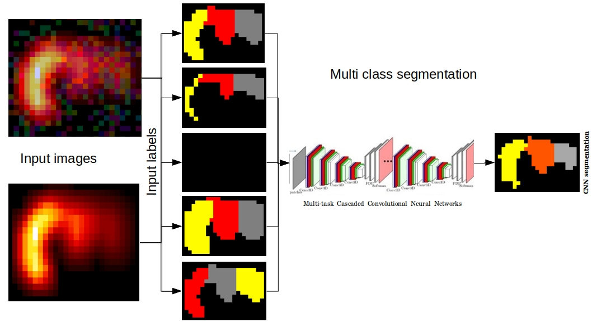

[](https://github.com/UCLBrain/MSLS/issues)
[](https://github.com/UCLBrain/MSLS/network)
[](https://github.com/UCLBrain/MSLS/stargazers)
[](https://github.com/UCLBrain/MSLS/blob/master/LICENSE)


# Multi-Label Multi/Single-Class Image Segmentation


<br>
 
</br>

# Running the GUI Program! 

First, user needs to install Anaconda https://www.anaconda.com/

Then


```sh
  - conda env create -f conda_environment_Training_Inference.yml  
``` 
and 

```sh
  - conda activate traintestenv  
``` 
finally

```sh
  - python  Training_Inference_GUI.py 
``` 

After lunching the graphical user interface, user will need to provide necessary information to start training/testing as follows:  

<br>
 
</br>


# Running the Program from the command line!

First 

```sh
  - conda activate traintestenv  
``` 
then for training


```sh
  - python  segmentation_network_Training_without_GUI.py  [or annotation_network_Training_without_GUI.py]
``` 

for testing

```sh
  - python  segmentation_network_Inference_without_GUI.py  [or annotation_network_Inference_without_GUI.py]
``` 

# Testing the Program!

<br>
 
</br>

..................................................................................................................................................................

<br>
 
</br>


